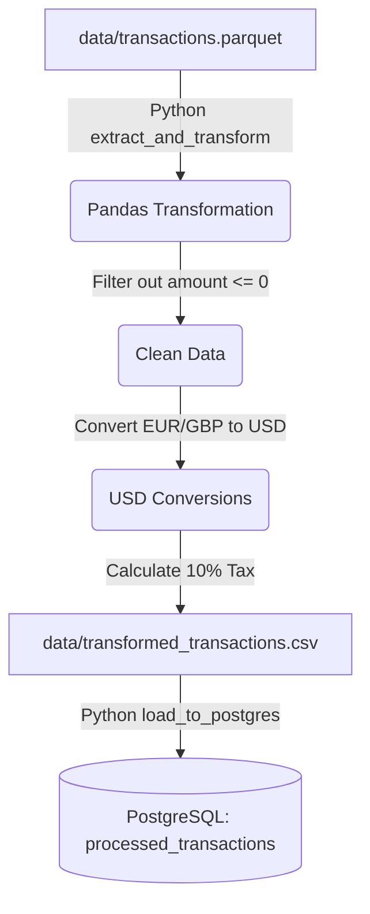

# Apache Airflow ETL Demo & Tutorial

This project is a complete, self-contained Apache Airflow demo that extracts user transaction data from a Parquet file, transforms the data using `pandas`, and loads it into a PostgreSQL database. It is managed using `uv` for python environments and `docker-compose` for the database.

---

## 📖 Airflow Concepts Tutorial

If you are new to Apache Airflow, here is a quick guide to the core concepts used in this project:

### 1. What is Apache Airflow?
Apache Airflow is an open-source platform used to programmatically author, schedule, and monitor workflows. Workflows are defined as code (Python), which makes them dynamic, extensible, and easy to maintain.

### 2. Core Components in this Demo

*   **DAG (Directed Acyclic Graph)**: A DAG is a collection of all the tasks you want to run, organized in a way that reflects their relationships and dependencies.
    *   *In this demo*: The DAG is defined in [`parquet_to_postgres_dag.py`](./airflow_home/dags/parquet_to_postgres_dag.py) and is named `parquet_to_postgres_etl`.
*   **Tasks & Operators**: A task is the basic unit of execution. An **Operator** is the template for a task. Airflow provides many pre-built operators:
    *   `PostgresOperator`: Used to execute SQL commands in a PostgreSQL database. We use this to execute a `CREATE TABLE` query.
    *   `PythonOperator`: Used to execute arbitrary Python functions. We use this to run the Pandas extraction, transformation, and database loading.
*   **Hooks**: A Hook is a high-level interface to external platforms and databases. While operators represent a step in a DAG, Hooks are typically used inside Operators (especially PythonOperators) to interact with external services.
    *   *In this demo*: We use the `PostgresHook` to clean up the target table and perform batch inserts of our transformed dataframe.
*   **Connections**: Airflow stores connection details (host, port, credentials) to external systems in its metadata database.
    *   *In this demo*: We define a connection ID named `postgres_default` pointing to our local PostgreSQL Docker container.

---

## 🛠️ Project Architecture

The ETL workflow follows this flow:



*   **Environment Manager**: `uv` (a fast alternative to `pip`/`poetry` written in Rust).
*   **Database**: PostgreSQL 15 running inside Docker.
*   **Orchestration**: Apache Airflow 2.10.4 running locally.

---

## 🚀 Getting Started

### Prerequisites
Make sure you have the following installed:
1.  **Docker** & **Docker Compose**
2.  **uv** (Install via `curl -LsSf https://astral.sh/uv/install.sh | sh` or `brew install uv`)

### Step 1: Clone & Initialize the Environment
The project dependencies are already installed inside the virtualenv. You can activate the virtual environment and inspect it:
```bash
source .venv/bin/activate
```

### Step 2: Spin up the PostgreSQL database
Start the Postgres container using Docker Compose:
```bash
docker compose up -d
```
You can verify it is healthy by running:
```bash
docker inspect --format='{{.State.Health.Status}}' airflow-postgres
# Should return "healthy"
```

### Step 3: Run the Complete Demo (with Airflow Web UI)
The script `./run_demo.sh` automatically configures connections, generates mock data, and boots Airflow:
```bash
./run_demo.sh
```
1.  It will print out login credentials (username `admin` and a generated password).
2.  Open your browser to `http://localhost:8080`.
3.  Log in, find the DAG `parquet_to_postgres_etl`, toggle it to **Active**, and click **Trigger DAG**.

---

## 🧑‍💻 Code Walkthrough

### 1. Generating Mock Parquet Data
The file [`scripts/generate_mock_data.py`](./scripts/generate_mock_data.py) simulates an upstream system generating transactional records. It produces `data/transactions.parquet` containing columns like:
- `transaction_id`, `user_id`, `timestamp`
- `amount` (contains positive and negative numbers to simulate bad data)
- `currency` (mix of `USD`, `EUR`, and `GBP`)

### 2. The ETL Pipeline
Open [`airflow_home/dags/parquet_to_postgres_dag.py`](./airflow_home/dags/parquet_to_postgres_dag.py). It consists of three tasks:

#### Task 1: Create Table (`PostgresOperator`)
This task runs SQL to ensure the target table is ready:
```python
create_table = PostgresOperator(
    task_id='create_table',
    postgres_conn_id='postgres_default',
    sql="""
    CREATE TABLE IF NOT EXISTS processed_transactions (
        transaction_id VARCHAR(50) PRIMARY KEY,
        user_id VARCHAR(50) NOT NULL,
        timestamp TIMESTAMP NOT NULL,
        original_amount NUMERIC(10, 2) NOT NULL,
        original_currency VARCHAR(10) NOT NULL,
        amount_usd NUMERIC(10, 2) NOT NULL,
        tax_amount NUMERIC(10, 2) NOT NULL,
        total_amount_usd NUMERIC(10, 2) NOT NULL
    );
    """
)
```

#### Task 2: Extract & Transform (`PythonOperator`)
This reads the Parquet data and processes it:
1.  Filters out transactions with `amount <= 0`.
2.  Normalizes currency based on static exchange rates.
3.  Calculates `tax_amount` (10% of USD amount) and `total_amount_usd`.
4.  Writes the result to a CSV file (`data/transformed_transactions.csv`).

#### Task 3: Load (`PythonOperator` using `PostgresHook`)
This task connects to PostgreSQL and inserts data:
```python
def load_to_postgres():
    df = pd.read_csv(TRANSFORMED_FILE)
    postgres_hook = PostgresHook(postgres_conn_id='postgres_default')
    
    # Empty table first for reproducibility
    postgres_hook.run("TRUNCATE TABLE processed_transactions;")
    
    # Bulk insert rows
    rows = [tuple(x) for x in df.to_numpy()]
    fields = list(df.columns)
    postgres_hook.insert_rows(table='processed_transactions', rows=rows, target_fields=fields)
```

### 3. Local Debugging & Testing
You do not need to run the entire Airflow Scheduler and Webserver to test your DAGs. Airflow supports running a DAG run directly via code:
```python
if __name__ == "__main__":
    dag.test()
```
You can trigger this direct execution by running:
```bash
export AIRFLOW_HOME="$(pwd)/airflow_home"
uv run python airflow_home/dags/parquet_to_postgres_dag.py
```

---

## 🔍 Verifying the Loaded Data

To confirm the data was loaded from your command line:
```bash
docker exec -it airflow-postgres psql -U postgres -d analytics -c "SELECT * FROM processed_transactions LIMIT 5;"
```
This will display the transformed, tax-adjusted transaction records loaded successfully into the database.
